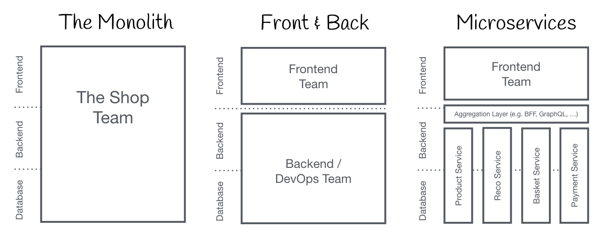

# Micro Frontends

# Content of this document

- [Key Concept of micro frontend architecture (MFA)](#mfa)
- [How to create micro frontends with Module Federation](#mf)
- [The Demo App](#dm)
  - [GroupUI integration](#gui)

# <a id="mfa"></a>Key Concept of micro frontend architecture (MFA)

## Context

Nowadays the frontedns are often developed as single page apps(SPA), such as React/Vue etc., which sits on top of a micro service architecture. Over time the frontend grows and gets more difficult to maintain. That is what we call a Frontend Monolith, with some typical drawbacks

- Only ONE Repo, any changes need a new deplyment for the whole app
- For large Repo, the build time takes longer
- The codes are tightly coupled and cannot be easily separated
- Framework or technologies difficult to update
- Performace issues, difficult to scale



For larger and more complex applications, other frontend architectures such as **Microfrontends** may be more suitable.

## The Micro frontend architecture
The term Micro Frontends first came up in [ThoughtWorks Technology Radar](https://www.thoughtworks.com/radar/techniques/micro-frontends) at the end of 2016. It extends the concepts of micro services of the backend to the frontend world. 

The idea behind Micro Frontends is to split a web app into samll, reusable web modules/components, which are owned and developed by independent teams. Each team has a distinct area of business or mission it cares about and specialises in. A team is cross functional and develops its features end-to-end, from database to user interface.


### The concept with Micro frontends


### Benifits of micro frontends:

- Independent development by teams and dynamically import code from other applications at runtime. End results feels like an SPA.
- Independent testing and deployment/release strategies.
- Smaller and optimised bundle size of each micro app as shared components and dependencies are loaded only when required.
- Each of the micro app can choose their own tech stack and not bound by a particular framework.

Even though MFA has many advantages over monolith, you should ask yourself before using it

- Is you application large & complex enough to use MFA?
- Can MFA really solve/improve the problems in your current monolith-architecture
- What about the migration? totally new development or jsut step-to-step upgrade/migration
- Is development with decentralized teams managable? Has your company enough personal/ressourcen

To move from the monolithic to micro architecture in frontend applications, different approaches have been experimented with, such as

- Sharing NPM packages
- iFrame
- WebComponents

With the new release of Webpack 5 in 2020, a new approch with Module Federation is introduced.

# <a id="mf"></a> How to create micro frontends with Module Federation?

Module Federation is one of the most exciting features in Webpack 5 released in 2020 and is considered a game-changer in JavaScript architecture. It supports more independent and straightforward code sharing at runtime among JavaScript applications, making the applications more adaptive and dynamic. It is not a framework but a plugin that provides flexibility in building your project.

Module Federation is an advanced feature in Webpack that provides a way for a JavaScript application to dynamically load code from another application. This feature allows for efficient code sharing and dependency management.
It allows loading (remote) micro frontends at runtime into a shell/host application without any build time dependency.

Module Federation comprises three main components:

- **Host** The Webpack build initialized first during a page build is the host. The host application contains typical features from a SPA or SSR application that boots and renders the components the user would see first.
- **Remote** Remote is another Webpack build from which the host can consume a part. It can strictly be either a remote or a host. The major functionality of a remote is to expose modules to be consumed.
- **Shared** The code is downloaded during run time and if any dependency is missing then the host application downloads the dependency. If the dependency has been shared between the micro frontends then the same is used. This leads to less duplication and lesser code size.

Depends on which build tool(webpack, vite etc.) you use in your app, it is always possible to use Module Federation. As said before it is a plugin, this makes it possible to use Module Federation with Vite, which is widely used in System42 NG.

# <a id="dm"></a> The Demo App

In this demo app, we create a Remote app with a CounterButton, and will be consumed in the host app. In the host app, we define the layout and use routings to naviagte between all pages.

## Install Vite Module Federation plugin

In each of your apps(host or remote), use this to install the plugin. The settings for host or remote apps will be described later.

```
npm install @originjs/vite-plugin-federation --save-dev
```

More details can be found at the official web site
https://github.com/originjs/vite-plugin-federation

## The Remote App

Creating a react app, and install the vite plugin

```
npm create vite
npm install @originjs/vite-plugin-federation --save-dev
```

We will create a component `CounterButton`, which will be exposed to the host app.

```ts
// CounterButton.tsx
import { useState } from "react";
import { GroupuiButton } from "@group-ui/group-ui-react";
import { defineCustomElements } from "@group-ui/group-ui-react/node_modules/@group-ui/group-ui/dist/components";

void defineCustomElements();

export default function CounterButton() {
  const [count, setCount] = useState(0);

  return (
    <div className="bg-amber-100 px-2 m-3 border-dashed border-2 border-green-500">
      <p className="italic">remote GroupuiButton from app 1</p>
      <GroupuiButton
        className="font-button"
        onClick={() => setCount((count) => count + 1)}
      >
        count is {count}
      </GroupuiButton>
    </div>
  );
}
```

Let's take a closer look at the important settings

```ts
// vite.config.ts
import { defineConfig } from 'vite'
import react from '@vitejs/plugin-react'
import federation from "@originjs/vite-plugin-federation";

// https://vitejs.dev/config/
export default defineConfig({
  plugins: [
    react(),
    federation({
      name: "app1",
      filename: "remoteEntry.js",
      exposes: {
        "./CounterButton": "./src/CounterButton", // This makes the CounterButton available to other apps. Each to be exposed component should be defined here.
      },
      remotes: {
      },
      shared: ["react", "react-dom"],
    }),
  ],
})
```

- **name** A meaningful and unique name for this exposed remote app
- **filename** This determines the filename of the output bundle in Module Federation, which can be accessible via http://localhost:8080/assets/remoteEntry.js
- **exposes** A list of all your to to exposed modulkes to other apps.
- **remotes** Can be empty for remote apps.
- **shared** This is an essential configuration option, allowing you to share libraries on which the exposed module depends to run.

With these seetings, the CounterButton can be now referenced in the host app as a "local" component.

## The Host App

Creae the host app, install the vite plugin

```
npm create vite
npm install @originjs/vite-plugin-federation --save-dev
```

In the vite config file

```ts
// vite.config.ts
import federation from "@originjs/vite-plugin-federation";

// https://vitejs.dev/config/
export default defineConfig({
  plugins: [
    react(),
    federation({
      name: "shellApp",
      filename: "remoteEntry.js",
      exposes: {
        // as for host app, we don't need to expose anything
      },
      remotes: {
        // end point of the remote app 1
        app1: "http://localhost:8080/assets/remoteEntry.js",
      },
      shared: ["react", "react-dom"],
    }),
  ],
});
```

The relevant seetings here

- **remotes** defines the end points of the all used remote apps. The name app1 will be used as "namespace" for the import.

To use the remote CounterButton, we refer to the key defined before

```ts
import CounterButton1 from "app1/CounterButton";

export default function HomeContent() {
  return (
    <>
      <div className="bg-green-200 m-3 p-4">
        <CounterButton1></CounterButton1>
      </div>
    </>
  );
}
```


### Layout & Routing

TBD

## Routing optimization

In the first attempt, we expose all routing-related pages of remote apps to the shell app, so that it can define the whole routings cross all apps.

### Concern of separation

From the point of view of the concern of separation, the shell app should not take care of the routing definition of the remote apps. Each remote app team is responsilbe for it. So we need a solution to achieve this.

### Performance optimization

On the other hand, the separation of the routing-definition reduces also the unnecessary ressourcen to be loaded. Meanwhile, to load a remote app with Group UI dependency, the ressourcen loaded is about 3 MB, which ist pretty big. The more apps we have, the more ressourcen need to be loaded. Module federation supports the React lazy loading mechanism, which makes it possible, to load ressourcen only if the app or resoucenn is needed.

### The implementation of routing-separation

The `MainLayout.tsx` in the shell app is the responsilbe for the whole routing.

Without routing-separation, it looks like this(using nested routing of React, which is optional)

```ts
// MainLayout.tsx
<Route path="app1" element={<App1 />}>
  <Route index element={<App1Home />} />
  <Route path="app1content" element={<App1Content />} />
  <Route path="app1detail" element={<App1Detail />} />
</Route>
```

With routing-separation, we just define a wildcard `app1/*`

```ts
<Route path="app1/*" element={<MicroFrontendOnePage />} />
```

The magic is to load the module lazy

- The we defin a module `app1/App1Layout`
- MicroFrontendOnePage loads the module(with the routing definition of app 1) lazy

```ts
// remoteTypes.d.ts
declare module "app1/App1Layout" {
  import { ComponentType } from "react";
  interface Props {}
  const MicrofrontendOne: ComponentType<Props>;
  export default MicrofrontendOne;
}
```

```ts
// MicroFrontendOnePage.tsx
const MicroFrontendOneLazy = lazy(() => import("app1/App1Layout"));

export default function MicroFrontendOnePage() {
  return (
    <div className="App">
      <Suspense fallback="Loading app1 ...">
        <MicroFrontendOneLazy />
      </Suspense>
    </div>
  );
}
```

What important here is the format path of the import `app1/App1Layout`

- The first part `app1` is the name/key of the remote app, which is unique and defined in the shell app.
- The second part `App1Layout` is the name of the remote (layout)component from the remote app.

```ts
// vite.config.ts of shell app
    federation({
      name: "shell_app",
      filename: "remoteEntry.js",
      exposes: {

      },
      remotes: {
        app1: "http://localhost:3001/assets/remoteEntry.js"
      },
    }),
```

```ts
// vite.config.ts of app 1
    federation({
      name: "app1",
      filename: "remoteEntry.js",
      exposes: {
        "./App1Layout": "./src/App1Layout",
      },
    })
```

```ts
// App1Layout.tsx
export default function App1Layout() {
  return (
    <>
      {/* no Router tag */}
      <nav>
        <Link to="">app1</Link>|<Link to="app1home">app1-home</Link>|
        <Link to="app1content">app1-content</Link>|
        <Link to="app1detail">app1-detail</Link>
      </nav>
      <Outlet></Outlet>

      <Routes>
        <Route index element={<App1Home />} />
        <Route path="app1home" element={<App1Home />} />
        <Route path="app1content" element={<App1Content />} />
        <Route path="app1detail" element={<App1Detail />} />
      </Routes>
    </>
  );
}
```

Using the `<Outlet />`-tag we can display the pages of app 1 and have the navigation menu always on the top.


A common scene in the host app is, this app used as a

# <a id="gui"></a>How to integrate GroupUI?

To avoid version conflicts in the host app between different remote components (from different remote apps using different GroupUI versions) , GroupUI will introduce new component tags in each major update.
For example, `<GroupuiButton />` will change to `<Groupui1010Button />` if the new version is 10.1.0.

## Install GroupUI
Add GroupUI reference in packages.json
```
https://groupui.vwapps.run/specific/10.1.0/versioned/group-ui-react.tgz
```


For more details to install GroupUI, please refer to https://digitaldesign.volkswagen-group.com/document/1717#/getting-started/developing

## Additional settings

To expose a component, it is neccesary to add these 2 code lines in the component file. In the main.tsx you still need these 2 lines!

```ts
import { defineCustomElements } from "@group-ui/group-ui-react/node_modules/@group-ui/group-ui/dist/components";
void defineCustomElements();
```

If you have multiple such components, only one import is neccesary.

## Version upgrade

If one App should be upgraded, following changes must be made

- Updatet the package version in packages.json
- Update all css class definitions with version info, e.g. `groupui-10-2-0-header`
- Update all GroupUI tags, such as `Groupui1010Button`, should be changed to `Groupui1020Button`

```css
.header-navigation-items groupui-10-2-0-header {
  border-radius: 2px 2px 0 0;
  display: flex;
  justify-content: center;
}
```

An ultility function during the package update will also be avaible, so that all css classes and GroupUI tags will be automatically updated. The only change that should be made manually is just to change the package version in the `packages.json`. This makes the update safer and more comfortable
